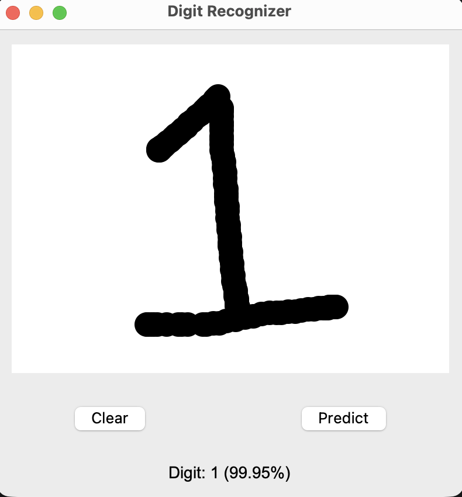
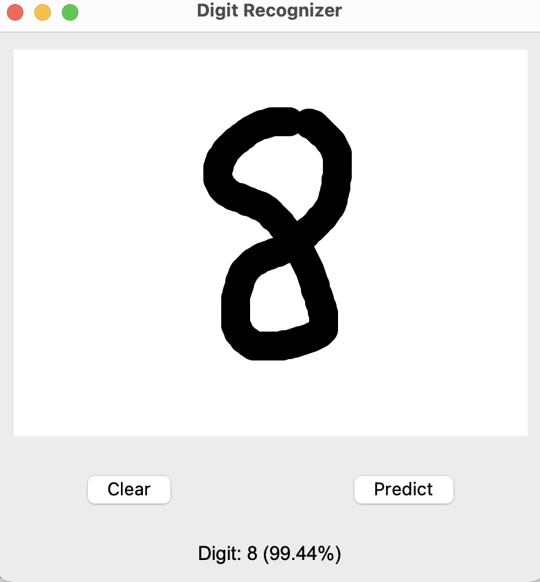

# Handwritten Digit Recognition

A convolutional neural network for recognising handwritten digits, trained on MNIST and deployable via an interactive drawing canvas.

## Results

| Model          | Test Accuracy (MNIST) | Custom test set (6 digits) |
|----------------|-----------------------|----------------------------|
| CNN            | ~99%                  | 6/6 correct                |
| Dense baseline | ~97%                  | ?/6 correct                |

The CNN uses two Conv2D + MaxPooling blocks with dropout regularisation, followed by a fully connected classifier head. Trained for 5 epochs with the Adam optimiser and sparse categorical crossentropy loss.

## Architecture

**CNN:**

Input (28×28×1) → Conv2D(32, 3×3, ReLU) → MaxPool(2×2) → Dropout(0.25) → Conv2D(64, 3×3, ReLU) → MaxPool(2×2) → Dropout(0.25) → Flatten → Dense(128, ReLU) → Dropout(0.5) → Dense(10, softmax)

## Running it

```bash
pip install -r requirements.txt

# Train the CNN
python train_cnn.py

# Launch the interactive drawing GUI (loads the trained model)
python gui.py
```

## GUI

A Tkinter canvas lets you draw a digit with the mouse; pressing Predict runs the CNN on the drawing (normalised and resized to 28×28) and displays the predicted digit along with confidence.

 

## Files

- `train_cnn.py` — trains the CNN and saves `cnn_handwritten_digits.keras`
- `train_dense.py` — trains a simpler dense baseline for comparison
- `gui.py` — drawing canvas with real-time prediction
- `digits/` — six handwritten test images used to evaluate the trained models
