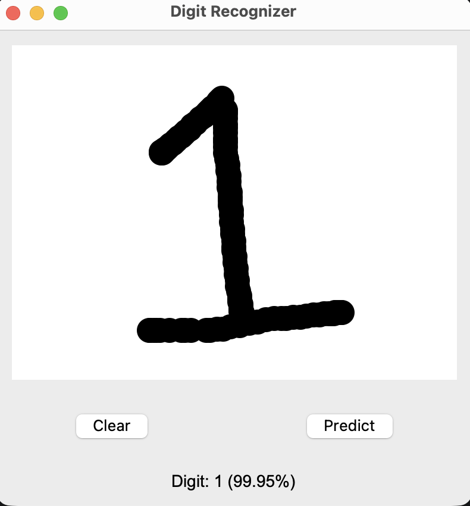
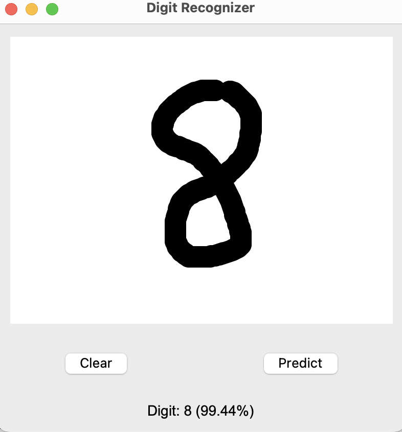

# Handwritten Digit Recognition

A convolutional neural network for recognising handwritten digits, trained on MNIST and deployable via an interactive drawing canvas.

## Results

| Model          | Test Accuracy (MNIST) | Custom test set (6 digits) |
|----------------|-----------------------|----------------------------|
| CNN            | ~99%                  | 6/6 correct                |
| Dense baseline | ~97%                  | 5/6 correct                |

The CNN wins because:

* Convolutional filters learn local spatial features (edges, curves, stroke junctions) directly from the 2D image, while the dense baseline flattens the input and loses that structure.
* Pooling adds a degree of translation tolerance, so a digit shifted a few pixels still activates the same features. This helps on the hand-drawn test images where stroke placement varies.
* Shared filter weights mean fewer parameters do more work, so the CNN generalises better on the same training budget.

The CNN uses two Conv2D + MaxPooling blocks with dropout regularisation, followed by a fully connected classifier head. Trained for 5 epochs with the Adam optimiser and sparse categorical crossentropy loss.

## Architecture

**CNN:**

| Layer | Details |
|-------|---------|
| Input | 28×28×1 |
| Conv2D | 32 filters, 3×3, ReLU |
| MaxPooling | 2×2 |
| Dropout | 0.25 |
| Conv2D | 64 filters, 3×3, ReLU |
| MaxPooling | 2×2 |
| Dropout | 0.25 |
| Dense | 128 units, ReLU |
| Dropout | 0.5 |
| Output | 10 units, softmax |

## Running it

```bash
pip install -r requirements.txt

# Train the CNN
python train_cnn.py

# Launch the interactive drawing GUI (loads the trained model)
python gui.py
```

## GUI

A Tkinter canvas lets you draw a digit with the mouse; pressing Predict runs the CNN on the drawing (normalised and resized to 28×28) and displays the predicted digit along with confidence.




## Files

- `train_cnn.py` — trains the CNN and saves `handwritten_digits.keras`
- `train_dense.py` — trains a simpler dense baseline and saves `dense_handwritten_digits.keras`
- `gui.py` — drawing canvas with real-time prediction
- `digits/` — six handwritten test images used to evaluate the trained models
